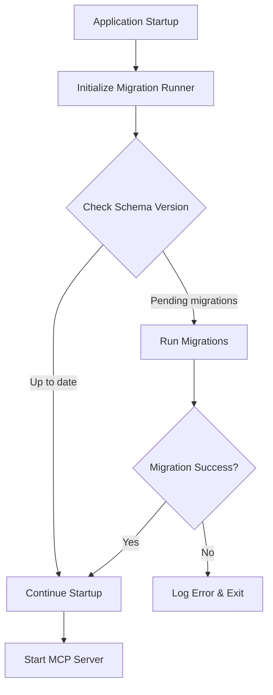

# Migration System Refactoring Design Document

## Overview
This document outlines the refactoring of the current migration system from manual SQL execution to using the industry-standard `golang-migrate` library with embedded migrations.

## 1. Current State Analysis

### 1.1 Existing Migration System
The current system uses a manual migration approach implemented in [`cmd/knowledge-base-stdin/main.go`](cmd/knowledge-base-stdin/main.go:70-126):

- **Manual SQL Execution**: Migrations are executed by directly running SQL statements
- **Hard-coded Schema**: Schema definitions are duplicated in both migration files and code
- **No Version Tracking**: No mechanism to track which migrations have been applied
- **Limited Rollback**: No rollback capability for schema changes
- **No Migration History**: Cannot determine the current schema version

### 1.2 Current Limitations
- **No Atomic Migrations**: Cannot ensure migrations run atomically
- **No Concurrent Safety**: Multiple instances could run migrations simultaneously
- **No Schema Versioning**: Cannot determine if database is at expected version
- **Maintenance Overhead**: Schema changes require updates in multiple places
- **No Migration Tooling**: Missing standard migration commands (up/down/force)

### 1.3 Current Migration Files
- `migrations/000001_create_knowledge_base_table.up.sql` - Creates schema
- `migrations/000001_create_knowledge_base_table.down.sql` - Drops schema

## 2. Proposed Changes for Embedding Migrations

### 2.1 golang-migrate Integration
Replace the manual migration system with `golang-migrate` which provides:
- **Version Tracking**: Automatic tracking of applied migrations
- **Atomic Operations**: Ensures migrations run completely or not at all
- **Rollback Support**: Ability to roll back to previous versions
- **Concurrent Safety**: Prevents race conditions during migrations
- **Embedded Migrations**: Migrations compiled into the binary using `embed` package

### 2.2 Migration File Structure
Maintain existing migration files but enhance with golang-migrate conventions:
```
migrations/
├── 000001_create_knowledge_base_table.up.sql
├── 000001_create_knowledge_base_table.down.sql
├── 000002_add_indexes.up.sql
├── 000002_add_indexes.down.sql
└── ...future migrations...
```

### 2.3 Embedded Migration Source
Use `embed` package to embed migration files directly into the binary:
```go
//go:embed migrations/*.sql
var migrations embed.FS
```

### 2.4 Migration Runner
Create a dedicated migration runner that:
- Initializes golang-migrate with embedded source
- Runs pending migrations automatically
- Provides migration status information
- Handles migration failures gracefully

## 3. Acceptance Criteria

### 3.1 Functional Requirements
- [ ] **Migration Execution**: All existing migrations run successfully with golang-migrate
- [ ] **Version Tracking**: Database contains `schema_migrations` table tracking applied versions
- [ ] **Embedded Migrations**: Migration files are embedded in the binary using `embed`
- [ ] **Backward Compatibility**: Existing databases migrate seamlessly
- [ ] **Rollback Support**: Ability to roll back to previous migration versions
- [ ] **Status Reporting**: Can query current migration version and pending migrations

### 3.2 Technical Requirements
- [ ] **No External Dependencies**: Migrations run without external file system access
- [ ] **Concurrent Safety**: Multiple instances can run without migration conflicts
- [ ] **Error Handling**: Clear error messages for migration failures
- [ ] **Logging**: Comprehensive logging of migration operations
- [ ] **Testing**: Unit tests for migration functionality

### 3.3 Performance Requirements
- [ ] **Fast Startup**: Migration check completes in <100ms for already-migrated databases
- [ ] **Minimal Overhead**: Embedded migrations add <1MB to binary size
- [ ] **Efficient Queries**: Uses indexed queries for migration version checks

## 4. Implementation Approach

### 4.1 Phase 1: Add golang-migrate Dependency
```bash
go get github.com/golang-migrate/migrate/v4
go get github.com/golang-migrate/migrate/v4/database/sqlite3
go get github.com/golang-migrate/migrate/v4/source/iofs
```

### 4.2 Phase 2: Create Migration Runner
Create new package `internal/migrations/` with:
- [`runner.go`](internal/migrations/runner.go) - Main migration runner
- [`embed.go`](internal/migrations/embed.go) - Embedded migration source
- [`config.go`](internal/migrations/config.go) - Migration configuration

### 4.3 Phase 3: Refactor Main Application
Update [`cmd/knowledge-base-stdin/main.go`](cmd/knowledge-base-stdin/main.go:48-52):
- Replace `runMigrations()` with new migration runner
- Remove manual migration code
- Update initialization sequence

### 4.4 Phase 4: Testing Infrastructure
Create comprehensive tests:
- [`runner_test.go`](internal/migrations/runner_test.go) - Migration runner tests
- [`integration_test.go`](internal/migrations/integration_test.go) - End-to-end tests
- Test fixtures for different migration scenarios

### 4.5 Migration Flow Diagram


## 5. Testing Strategy

### 5.1 Unit Tests
**Test File**: [`internal/migrations/runner_test.go`](internal/migrations/runner_test.go)

Test cases:
- **TestNewRunner**: Creates runner with embedded migrations
- **TestRunMigrations**: Runs migrations on fresh database
- **TestRunMigrationsIdempotent**: Running migrations twice has no effect
- **TestMigrationVersion**: Correctly identifies current migration version
- **TestRollback**: Successfully rolls back to previous version
- **TestInvalidDatabase**: Handles invalid database connection
- **TestCorruptedMigrations**: Handles corrupted migration files

### 5.2 Integration Tests
**Test File**: [`internal/migrations/integration_test.go`](internal/migrations/integration_test.go)

Test scenarios:
- **Fresh Database**: Migrations run successfully on new database
- **Existing Database**: Seamless migration from manual to golang-migrate
- **Partial Migration**: Handles interrupted migration scenarios
- **Concurrent Access**: Multiple instances handle migration safely
- **Embedded Files**: Verify migrations are correctly embedded

### 5.3 Table-Driven Tests
```go
tests := []struct {
    name        string
    setupFunc   func(*testing.T) string
    expectError bool
    validate    func(*testing.T, *Runner)
}{
    {
        name: "fresh database",
        setupFunc: setupFreshDB,
        expectError: false,
        validate: validateFreshMigration,
    },
    // ... additional test cases
}
```

### 5.4 Performance Tests
- **Migration Speed**: Measure time to check already-migrated database
- **Binary Size**: Verify embedded migrations don't significantly increase binary size
- **Memory Usage**: Monitor memory usage during migration operations

### 5.5 Compatibility Tests
- **Existing Data**: Ensure existing data remains intact after migration
- **Schema Validation**: Verify schema matches expected structure post-migration
- **Rollback Scenarios**: Test rolling back through multiple versions

## 6. Migration Commands (Future Enhancement)

While the initial implementation will auto-run migrations, future versions could include CLI commands:

```bash
# Check migration status
knowledge-base-stdin -db knowledge.db -migrate-status

# Run pending migrations
knowledge-base-stdin -db knowledge.db -migrate-up

# Rollback last migration
knowledge-base-stdin -db knowledge.db -migrate-down 1

# Force specific version
knowledge-base-stdin -db knowledge.db -migrate-force 1
```

## 7. Risk Mitigation

### 7.1 Backward Compatibility
- **Data Preservation**: All existing data will be preserved
- **Schema Compatibility**: New migration system produces identical schema
- **Rollback Plan**: Can revert to manual migration if needed

### 7.2 Error Handling
- **Migration Failures**: Clear error messages with actionable guidance
- **Database Corruption**: Backup strategy for critical databases
- **Version Conflicts**: Handle cases where manual migrations were partially applied

### 7.3 Testing Strategy
- **Staging Environment**: Test migration on staging databases
- **Rollback Testing**: Verify rollback functionality works correctly
- **Performance Validation**: Ensure migration check doesn't impact startup time

## 8. Success Metrics

- **Migration Success Rate**: 100% success rate for automated migrations
- **Startup Time**: <100ms additional startup time for migration check
- **Binary Size**: <1MB increase in binary size due to embedded migrations
- **Error Rate**: <0.1% error rate for migration operations
- **Developer Satisfaction**: Positive feedback on migration workflow

## 9. Future Enhancements

- **Migration CLI**: Add command-line migration management
- **Migration Generation**: Tool to generate new migration files
- **Schema Diff**: Automatic generation of migration files from schema changes
- **Multi-Database Support**: Support for PostgreSQL, MySQL in addition to SQLite
- **Migration Validation**: Validate migration files before embedding